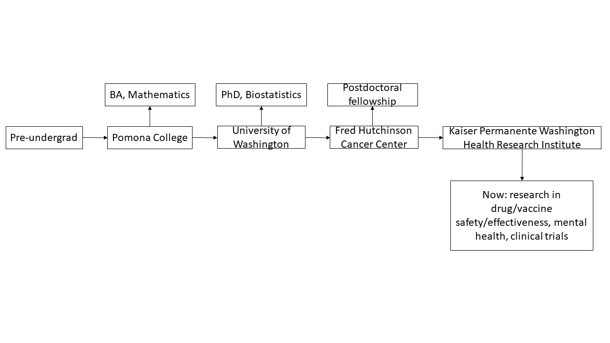

```{r xaringan-setup, include=FALSE, warning=FALSE}
library("xaringanthemer")

extra_css <- list(
  ".small" =  list(`font-size` = "80%"),
  ".large" =  list(`font-size` = "150%"),
  ".huge" =  list(`font-size` = "300%"),
  "ul li" = list(`margin-bottom` = "10px"),
  ".gray" = list(color = "#C0C0C0"),
  ".red" = list(color = "#FF0000"),
  ".blue1" = list(color = "#3AABBE"),
  ".blue2" = list(color = "#2A6D90"),
  ".blue3" = list(color = "#446874"),
  ".purple" = list(color = "#624474"),
  ".mutedred" = list(color = "#745344"),
  "a" = list(color = "#3AABBE"),
  "a:hover" = list("text-decoration" = "underline")
)
# set up fonts
style_mono_accent(
  base_color = "#446874",
  header_font_google = google_font("DM Sans"),
  text_font_google   = google_font("DM Sans", "400", "400i"),
  code_font_google   = google_font("Courier Prime"),
  extra_css = extra_css
)

xaringanExtra::use_tile_view()
```

<style type="text/css">
.remark-slide-content {
    font-size: 22px
}
</style>

## My journey to full-time statistics research

```{r timeline-1, echo = FALSE, out.width = "720px", fig.align = "center"}

```

---

## My journey to full-time statistics research

```{r timeline-2, echo = FALSE, out.width = "720px", fig.align = "center"}

```

---

## My journey to full-time statistics research

```{r timeline-3, echo = FALSE, out.width = "720px", fig.align = "center"}

```

---

## My journey to full-time statistics research

```{r timeline-4, echo = FALSE, out.width = "720px", fig.align = "center"}

```

---

## My journey to full-time statistics research

```{r timeline-5, echo = FALSE, out.width = "720px", fig.align = "center"}

```

---

## My journey to full-time statistics research

```{r timeline-6, echo = FALSE, out.width = "720px", fig.align = "center"}

```

---

## My journey to full-time statistics research

```{r timeline-7, echo = FALSE, out.width = "720px", fig.align = "center"}

```

---

## My journey to full-time statistics research

```{r timeline-8, echo = FALSE, out.width = "720px", fig.align = "center"}

```

---

## My journey to full-time statistics research

```{r timeline-9, echo = FALSE, out.width = "720px", fig.align = "center"}
knitr::include_graphics("img/timeline_9.png")
```

---

## My journey to full-time statistics research

```{r timeline-10, echo = FALSE, out.width = "720px", fig.align = "center"}
knitr::include_graphics("img/timeline_10.png")
```

---

## My journey to full-time statistics research

```{r timeline-11, echo = FALSE, out.width = "720px", fig.align = "center"}
knitr::include_graphics("img/timeline_11.png")
```

---

## My journey to full-time statistics research

```{r timeline-12, echo = FALSE, out.width = "720px", fig.align = "center"}
knitr::include_graphics("img/timeline_12.png")
```

---


## What do I do all day?

Biostatistics: turning data into knowledge (Patrick Heagerty, UW)

Most weeks for me involve:
--

* Coding or debugging in R and Python
--

* Reading scientific papers
--

* Doing math
--

* Meetings with collaborators:
--

    * doctors, infectious disease specialists
--

    * other statisticians
--

* Diversity, Equity, and Inclusion work

---

## What do I do all day?

Key skills:
* Curiosity
--

* Communication
--

* Time management
--

* Mathematical reasoning/logic

---

## Example: preparing for AMP

.pull-left[
```{r amp-fig, echo = FALSE, out.width = "270px", fig.align = "center"}
knitr::include_graphics("img/amp.png")
```
NIH NIAID-sponsored HVTN + HPTN phase 2b HIV prevention efficacy trial; statistical design described in Gilbert et al. (2017) _Stat Commun Infect Dis_

```{r neut-hiv, echo = FALSE, out.width = "270px", fig.align = "center"}
knitr::include_graphics("img/neutralized_hiv.png")
```
]

.pull-right[
```{r pred-prob-slapnap, echo = FALSE, out.width = "270px", fig.align = "center"}
knitr::include_graphics("img/pred_prob_resistance_slapnap.png")
```
Magaret, Benkeser, Williamson et al. (2019) _PLoS Comp Bio_
]

---

## Hypothesis testing

Primary goal of AMP: .blue1[test] whether or not the therapy is .blue2[effective].

--

Secondary goal of AMP: .green[which genetic mutations] make HIV-1 susceptible to neutralization?

--

```{r hiv-sequence-movie, echo = FALSE, out.width = "720px", fig.align = "center"}

```

--

Key challenges:
--

* What does "susceptible" mean? How to measure it? 
--

* How do we determine if a mutation has a real effect?
--

* How do we do this at .red[each position] on the HIV-1 genome?

---

## Hypothesis testing

Example: testing whether a single coin is fair

--

Suppose you have a single coin; probability of heads is $p_0$ (unknown)

--

Suppose you have results from 100 flips; proportion of heads $= 0.7$

--

Your friend says that if you correctly guess the next flip, you get $100; otherwise, your friend gets $200

--

You want to _test_ if the coin is fair, i.e., test: $$H_0: p_0 = 0.5 \text{ (coin is fair) vs } H_1: p_0 > 0.5 \text{ (coin is unfair)}$$

---

## Hypothesis testing

Make a decision based on the data 

--

Probability of a wrong decision?

--

|   | $H_0$ true | $H_1$ true
| - | ---------- | ----------
| Decide $H_0$ | 1 - $\alpha$ | type II error
| Decide $H_1$ | .red[type I error] ( $\alpha$ ) | .blue2[power] 

$\alpha = Pr(\text{reject } H_0 \mid H_0 \text{ true})$

--

High power = good: want to win money

--

Type I error = much worse: want to minimize chance of losing money 

--

.blue2[**Even more important**] to control type I errors in biomedical research

--

Typically, we pre-specify a level $\alpha$ of maximum allowable type I error

---

## Testing multiple hypotheses

**Goal:** test whether 10 different coins are fair

**Procedure:** perform level 0.05 test for each coin 

--

What is my overall chance of making a type I error?

--

.red[Not] $\alpha$! Why? 

---

## Testing multiple hypotheses

Intuition: chances of observing a rare event (type I error) increase with increased number of observations

--

&zwj;Mathematically:

$Pr(\text{reject } H_{0,1} \mid H_{0,1} \text{ true}) = \alpha$; $Pr(\text{don't reject } H_{0,1} \mid H_{0,1} \text{ true}) = 1 - \alpha$;

--

$$Pr(\text{don't reject } H_{0,2} \mid H_{0,2} \text{ true}) = 1 - \alpha;$$

--

$$\vdots$$
--

$$Pr(\text{don't reject any } \{H_{0,j}\}_{j = 1}^{10} \mid \{H_{0,j}\}_{j = 1}^{10} \text{ true}) = (1 - \alpha)^{10}$$

--

$$Pr(\text{reject one or more} \mid \{H_{0,j}\}_{j = 1}^{10} \text{ true}) = 1 -$$
$$Pr(\text{don't reject any } \{H_{0,j}\}_{j = 1}^{10} \mid \{H_{0,j}\}_{j = 1}^{10})$$

--

$= 1 - (1 - \alpha)^{10} \approx 40$%!!

---

## Adjusting for multiple comparisons

One simple way to adjust: divide $\alpha$ by the number of tests

--

&zwj;Example: genome-wide association study

Testing for effect at 1000 genes: $.05 / 1000 = .00005$

--

.red[This reduces power]: need **strong** effect!

--

Another option: pre-screen based on some criterion?

---

## Preparing for AMP

Recall the AMP problem: .green[which genetic mutations] make HIV-1 susceptible to neutralization?

--

**Problem:** thousands of potential mutations across HIV-1 genome
* Testing for effect of all mutations: small individual $\alpha$
* Low power!

**Goal:** pre-screen to a more reasonable number of mutations

--

**Procedure:** combine
* .blue1[machine learning] (more to come)

--

* publicly-available data

--

* .blue2[statistical inference] on variable importance (my PhD dissertation)

---

## Example: COVID-19 risk prediction

.pull-left[
```{r covid-seattle-times, echo = FALSE, out.width = "480px", fig.align = "center"}

```
Source: _Seattle Times_
]
.pull-right[
```{r seattle-flu-study, echo = FALSE, out.width = "360px", fig.align = "center"}

```

```{r scan, echo = FALSE, out.width = "360px", fig.align = "center"}

```
]

---

## Predicting clinical outcomes

**Goal:** predict death or intubation (being put on a ventilator) based on factors measured at time of admission to hospital 

--

**Challenges:**
* some measurements collected multiple times
* want to allow flexible relationship between features and response

**Idea:** use machine learning!

---

## Machine learning? (aka "artificial intelligence")

Often, purely for .blue1[prediction]

--

&zwj;Examples:
* Regression analyses (classical statistics)

--

* Decision trees: <a href="https://en.wikipedia.org/wiki/Deep_Blue_(chess_computer)">Deep Blue</a>, triage charts

--

* Neural networks: [AlphaGo](https://deepmind.com/research/case-studies/alphago-the-story-so-far), [AlphaFold](https://www.deepmind.com/blog/article/AlphaFold-Using-AI-for-scientific-discovery)

---

## Machine learning: bias vs variance

Any estimation technique has .red[bias] and .blue1[variance].

These correspond to .red[how far our estimates are from the truth] and .blue1[how variable our estimates are].

--

&zwj;Variability: if I repeated an experiment many times and analyzed the data, I wouldn't expect the same answer each time. "Variance" quantifies this.

--

Typically, inducing bias in estimation will result in decreased variance, and vice versa.

---

## Machine learning: bias vs variance

&zwj;Example: linear regression
* find line that best fits points
* "best-fitting":
```{r lm-init, echo = FALSE, out.width = "360px", fig.align = "center"}

```
---

## Machine learning: bias vs variance

&zwj;Example: linear regression
* find line that best fits points
* "best-fitting":
```{r lm-plus-sse, echo = FALSE, out.width = "360px", fig.align = "center"}

```

---

## Machine learning: bias vs variance

&zwj;Example: linear regression
* find line that best fits points
* "best-fitting":
```{r lm-plus-line, echo = FALSE, out.width = "360px", fig.align = "center"}

```

---

## Bias-variance tradeoff in action

Consider two options for obtaining predictions: either fit each point exactly (_interpolating_) or fit linear regression.

Interpolating has .red[zero bias] on the training data; linear regression has .red[some bias].

```{r bvt-1, echo = FALSE, out.width = "360px", fig.align = "center"}

```
---

## Bias-variance tradeoff in action

Moving one point from $(0.5, -0.58)$ to $(0.5, -0.08)$ changes the interpolating fit drastically, but doesn't change the linear regression fit.

Interpolating has .blue1[large variance] on the training data; linear regression has .red[small variance].

```{r bvt-2, echo = FALSE, out.width = "360px", fig.align = "center"}

```

---

## Machine learning: bias-variance tradeoff

Typically, machine learning methods allow .red[increased bias] on training data for .blue1[decreased variance], and possibly better predictions on test data.

This increased bias can be difficult to characterize, rendering **inference based on machine learning techniques difficult**.

One way to mitigate bias is to .blue2[average] many "base learners" together:
* e.g., [guessing the weight of a cow](https://www.npr.org/sections/money/2015/08/07/429720443/17-205-people-guessed-the-weight-of-a-cow-heres-how-they-did)
* often called "ensembling" or "model stacking"

---

## Example: HIV-1 vaccine regimen down-selection

bnAb: broadly neutralizing antibody

--

AMP trials studied a single bnAb; future trials study bnAb .blue1[combinations].

--

Key challenges for studying combinations:
* does a given combination neutralize HIV effectively?
* how should we prioritize the combinations to study in trials?

--

We've created a tool called SLAPNAP (**S**uper Le**A**rner **P**redictions using **NA**b **P**anels) to address these challenges.

---

## Key components of SLAPNAP: Containerization

```{r docker, echo = FALSE, out.width = "360px", fig.align = "center"}
knitr::include_graphics("img/docker.png")
```

* Lightweight
* Fully reproducible

---

## Key components of SLAPNAP: data and predictions

When the container is compiled, downloads a snapshot of publicly-available HIV-1 neutralization database.

--

&zwj;Predictions: use .blue1[ensembling] to develop the best-possible outcome predictor

--

Describe .blue2[variable importance] using methods from my PhD dissertation

---

## Current opportunities in statistics/comp. bio.

"Big Data": large number of observations
* can lead to computational challenges
* does more = better?
* Examples: Google data, electronic health records

"Big Data": large number of features
* difficult to assess relationship between features and response
* multiple testing
* number of observations smaller than number of features?
* Examples: genomic data

---

## Current opportunities in statistics/comp. bio.

Natural language processing: can we learn from text?
* what text is relevant for your problem?
* how to include in a statistical procedure?
* what quality of information do you have?
* Examples: electronic health records

Push for more agnostic modeling
* conventional practice: parametric models
* inferences can be wrong if misspecified!
* how to use machine learning to do inference?
